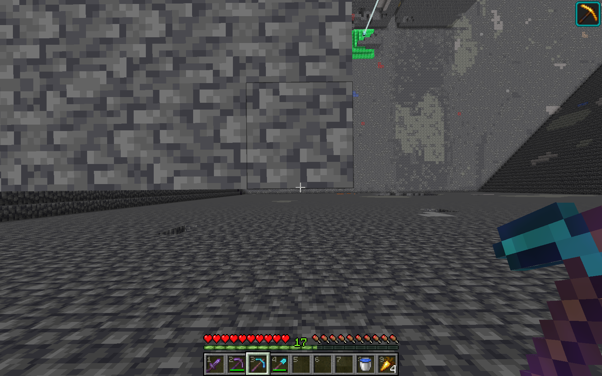

# py_miner
Копатель (онлайн) на Питоне под Экскалибур-Крафт.  

Есть две версии копателя: автономный и полу-автономный. Способ работы автономного скрипта основан на наличии статуса DELUXE для флая и супер-кирки. Полу-автономный скрипт, с другой стороны, можно использовать и без статуса. Описание как ими пользоваться ниже, после пункта об установке.  
  
# Как установить и запустить на Windows 
# Подготовка к установке
- Проверить наличие Git'a:
    - Открыть программу Terminal (должна быть встроенна в последние версии винды) или обычную командную строку (показывается в поиске винды при вводе `cmd`);
    - Прописать команду `git --help`;
    - Если выводит помощь, а не что-то вроде "команда не найдена", то всё хорошо, и можно переходить к следующему пункту. Если жалуется, что такой команды нет, то пора ставить Git:
        - Скачать установщик для винды с сайта: https://git-scm.com/downloads;
        - Запустить его и установить Git. Настройки можно оставить стандартными, если непонятно что они означают;
        - Открыть НОВЫЙ (обязятельно) терминал, и еще раз прописать команду `git --help`;
        - Если выводит помощь, то он установился. Если выводит, что команда не обнаружена, то надо добавить Git в переменную среду PATH:
            - Расписывать очень долго, так что вот статья с путеводителем: https://remontka.pro/add-to-path-variable-windows/;
            - Добавить в PATH нужно путь к папке, где находится .exe-шка. У меня, например, путь, добавленный в переменную среду PATH выглядит так: `C:\Users\Admin\dev\tools\Git\bin`;
            - Еще раз проверить наличие Git'a командой `git --help`. Если и на этот раз не помогло, то гг. Тут только гугл или мой дискорд;
- Проверить наличие Python'a:
    - Открыть терминал (смотреть выше о там как открыть);
    - Прописать команду `python --version`;
    - Если выводит что-то вроде `Python 3.10.9`, то все хорошо, и можно переходить к следующему пункту. Если выводит, что команда не найдена, пора ставить Питон:
        - Перейти по ссылке: https://www.python.org/downloads/, и скачать установщик;
        - Запустить установку, обязательно не забыв поставить галочку добавления в PATH, а то придется ставить самому;
        - Запустить новый (обязательно новый) терминал, и еще раз проверить установку командой `python --version`. Если все равно не работает, тут поможет только гугл или мой дискорд;
- Проверить наличие pip'a:  
    - Прописать в терминале команду `pip --version`. Если выводится версия по типу `pip 22.3.1 from *** (python 3.10)`, то все хорошо. Если нет, пора ставить `pip`:
        - Расписывать долго, вот туториал: https://pythonru.com/baza-znanij/ustanovka-pip-dlja-python-i-bazovye-komandy  
  
# Установка
- Открыть терминал в папке, где будет хранится проект. Есть два способа:
    - Зайти в нужную папку в Проводнике, нажать ПКМ по пустому месту и выбрать пункт "Открыть в Терминале". Если такого пункта нет, то есть пункт №2;
    - Открыть терминал, и командами перейти в нужную папку:
        - Перейти на диск, на котором хранится проект. Если он, например, на диске D, просто прописать команду `D:`, если на диске E, то `E:`. Терминал по дефолту открывается на диске С, так что если проект на нем, то ничё прописывать не надо;
        - Прописать команду `cd <путь к папке>`, где `<путь к папке>` - это путь к папке. В конце команда должна выглядеть как-то так: `C:\Users\Admin\dev\projects`;
- В этом же терминале прописать команды `git clone https://github.com/KpuBemKa/py_miner.git` и `cd .\py_miner\`;
- Прописать команду `pip install -r .\requirements.txt`. Это установит все необходимые библиотеки;
- Готово. Скрипт готов к запуску.
  
# Как использовать автономный скрипт  
- Запустить скрипт:
    - Открыть терминал в папке проекта как в пункте про установку, но зайти в папку "py_miner". В итоге путь должен выглядеть примерно так: `C:\Users\Admin\dev\projects\py_miner`;
    - Прописать следующую команду: `python .\main.py <количество блоков в одной линии>`. Например `python .\main.py 30`;
    - Это запустит скрипт, но он ничего не будет делать, пока не будет нажата нужная клавиша;
- Перейти в игру, и расположить персонажа:  
    - Включить режим полета командой `/dfly`;
    - Включить супер-кирку командой `/spa`;
    - Встать посередине в начало первого блока слоя (ниже скрин);
    - Взять в руки кирку;
- Нажать F6 для начала копания.

^ Пример расположение персонажа ^
  
## Горячие клавишы скрипта  
- **F6**: запустить копание;  
- **F7**: остановить копание;  
  
У скрипта есть возможность на один пролет скорректировать количество блоков, через которые он пролетит. Это необходимо из-за того, что скорость персонажа непостоянна, и персонаж иногда пролетает на блок / пол блока больше, чем запрошено (не знаю почему; либо пинг, либо моджанг). В скрипт встроена возможность на один пролет удлинить или уменьшить количество пройденных блоков.
По дефолту кнопки назначены так:  
- **]** - текущий пролет будет удлинен на примерно половину блока вперед  
- **&#92;** - текущий пролет будет удлинен на примерно половину блока назад  
- **[** - текущий пролет будет удлинен на примерно блок вперед  
- **&#39;** - текущий пролет будет удлинен на примерно блок назад  
  
Так же есть возможность пройти линию без того, чтобы двигать персонажа вниз. Это нужно тогда, когда на линии скапливаются столбы непрокопанных блоков из-за лагов супер-кирки.  
По дефолту кнопка активации назначена на `.`.   
  
# Как использовать полу-автономный скрипт  
Действие скрипта основано по принципу -> поставить /sethome -> выкопать рядом столб до низа -> тп-нуться на /home -> выкопать рядом еще один столб -> и так далее. Итак:
  
- Запустить скрипт:
    - Открыть терминал в папке проекта как в пункте про установку, но зайти в папку "py_miner". В итоге путь должен выглядеть примерно так: `C:\Users\Admin\dev\projects\py_miner`;
    - Прописать следующую команду: `python .\simple_miner.py`;
    - Это запустит скрипт, но он ничего не будет делать, пока не будет нажата нужная клавиша;
- Установить командой `/sethome` точку дома в нужном месте;
- Нажать **F6**, чтобы включить копание. Скрипт будет просто держать левую кнопку мыши нажатой;
- Нажать **&acute;** при достижении нужной глубины. Это автоматически пропишет `/home`, откуда можно будет начать выкапывать другой столб;
- Нажать **F7**, чтобы остановить, но не закрыть скрипт (можно нажать F6 еще раз без повторного запуска в терминале);  
  
## Горячие клавишы скрипта
Клавиши запуска и остановки этого скрипта те же, что и у автономного. При их изменении в `settings.py`, они поменяются у обоих скриптов. 
  
- **F6**: запустить копание;  
- **F7**: остановить копание;  
- **&acute;**: прописать `/sethome`;
  
# Как изменить горячие клавиши скриптов:  
Все горячие клавиши можно поменять в файле `settings.py`, где:  
  
## Горячие клавиши обоих скриптов:
- **START_KEY**: дает скрипту команду начала копания;  
- **STOP_KEY**: дает скрипту команду остановки копания.  
  
## Горячие клавишы автономного скрипта:
- **FORWARD_TWEAK_KEY**: удлиняет текущий проход на пол блока вперёд;  
- **BACKWARD_TWEAK_KEY**: удлиняет текущий проход на пол блока назад;  
- **DOUBLE_FORWARD_TWEAK_KEY**: удлиняет текущий проход на блок вперёд;  
- **DOUBLE_BACKWARD_TWEAK_KEY**: удлиняет текущий проход на блок назад;  
- **CLEANUP_RUN_KEY**: следующий проход будет без прожатия шифта.
  
## Горячие клваиши полу-автономного скрипта:
- **HOME_N_RESTART_KEY**: прописывает `/home` и держит левую кнопку мыши нажатой.
